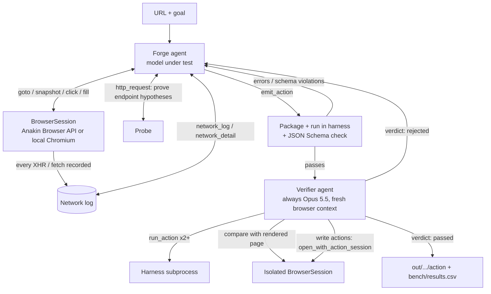

# Wire Forge — Architecture

Read this before touching the code. It explains how the pieces fit, which contracts are fixed,
and which tasks are open.

## 1. What we are building

Input: a URL and a goal in plain words ("add a shirt in a given size to the cart").
Output: a Wire action — a spec in the same shape as the Wire catalog, Python code that calls the
site's own backend with no browser, and a test — that an independent verifier has checked against
the live site.

For the Breakthrough track, we run the same pipeline with the previous Opus (`claude-opus-5`) and with
Opus 5.5 (`claude-opus-5-5`) on the same sites, and log both runs to `bench/results.csv`.

## 2. Pipeline



Loop limits: forge turns `WIREFORGE_MAX_TURNS` (60), repair rounds `WIREFORGE_MAX_REPAIRS` (2).

## 3. Module map

| File | Responsibility | Key things to know |
|---|---|---|
| `wireforge/config.py` | Models, keys, limits, blocked paths | All tunables live here and in `.env`. No magic numbers elsewhere. |
| `wireforge/browser.py` | `BrowserSession`: Playwright over Anakin CDP (`ANAKIN_API_KEY` set) or local Chromium; records xhr/fetch/document traffic; element refs for clicking | `_settle()` waits for real in-flight requests to drain. Do not replace it with `networkidle`: that only tracks the first load and misses fetches triggered by clicks. `isolated()` gives a second context with no shared cookies. |
| `wireforge/tools.py` | Tool definitions the agents see (browser + `http_request`) | Tool descriptions are the prompt. Change them carefully. |
| `wireforge/probe.py` | Direct HTTP for testing hypotheses; the `blocked()` guard | The checkout/payment guard lives here and is reused by the harness. |
| `wireforge/agent.py` | Generic streaming tool loop over the Messages API; `RunStats` | Appends `resp.content` **unchanged**, thinking blocks included. Opus 5.5 rejects edited history. Adaptive thinking, `effort` from config (Opus 5.5 defaults to `medium`; we set `high`). No forced `tool_choice`: Opus 5.5 returns a 400. |
| `wireforge/forge.py` | Forge agent: system prompt, `emit_action`, `finish`, `repair()` | `emit_action` validates, packages, runs and schema-checks every time, so the agent self-corrects before the verifier sees anything. `finish` is refused until the last emit passed. |
| `wireforge/spec.py` | Spec validation, packaging to disk, `run_action`, test template | Output spec matches the Wire catalog shape (`action_id`, `type`, `mode`, `parameters[]`), plus our `return_schema` and `endpoints`. |
| `wireforge/harness.py` | Runs one action in a subprocess | Owns the `httpx.Client`: blocks checkout URLs via an event hook and exports cookies after the run (used to verify write actions). |
| `wireforge/verifier.py` | Verifier agent + `submit_verdict` rules | Refuses a verdict until the action has run at least twice. A pass needs at least one matched check. An unexplained mismatch turns a pass into a fail. |
| `wireforge/pipeline.py` | Orchestration, repair loop, CSV row | Verifier model is fixed (`FORGE_MODEL`) so both models are judged by the same judge. |
| `wireforge/cli.py` | `forge` and `compare` commands | |
| `wireforge/web/server.py` | FastAPI: serves the site, JSON API over `out/` and `bench/results.csv`, starts runs in a background thread, streams `transcript.jsonl` as server-sent events | One run at a time (lock). `POST /api/runs` needs `WIREFORGE_PASSCODE` when set. `/api/tally` is the only source of numbers on the site. Run ids are resolved inside `OUT_DIR` only. |
| `wireforge/web/static/` | `index.html`, `app.css`, `app.js`: hash-routed single page (Home, Forge Board, Actions, Results, Safety) | Everything from a run is untrusted and goes through `esc()`; never put it into `innerHTML` raw. |

## 4. Contracts (do not change without telling the team)

**Generated action code**

```python
def run(params: dict, client: httpx.Client) -> dict: ...
```

- HTTP only through `client` (browser user agent, cookie jar, checkout guard).
- Standard library plus `httpx`, `re`, `json`. No hard-coded cookies or tokens: fetch them at run time.
- Write actions read the changed state back (for example GET the cart) and return it.

**Run directory** `out/<site>__<model>__<timestamp>/`

```
action/spec.json          Wire-shaped spec + return_schema + endpoints
action/action.py          the action
action/test_params.json   params that worked at build time
action/test_action.py     auto-generated pytest (live call + schema check)
request.json              url, goal, model, verifier model
transcript.jsonl          every tool call, thinking summary and text, for both agents, plus pipeline
                          stage events (start, trace, verify, repair, done, error) the board streams
last_run.json             last harness output from the forge
verdict.json              verifier checks and result
summary.json              the row written to bench/results.csv
```

**`bench/results.csv`**: one row per run. The columns are in `pipeline.CSV_FIELDS`. Numbers we show
judges come from this file only: never quote a number we did not just produce.

## 5. Safety rules built into the code

- `config.BLOCKED_PATH_WORDS` (checkout, payment, /pay, place-order, purchase) are refused in
  `http_request` and in the harness. Write actions stop at the cart.
- Both system prompts forbid checkout, payment and orders.
- No site passwords. Demo sites are guest-cart or public read sites only.

## 6. Running it

```bash
cp .env.example .env    # ANTHROPIC_API_KEY required, ANAKIN_API_KEY optional
python -m pytest        # offline tests, no key needed
python -m wireforge forge   <url> --goal "..." [--headed] [--model claude-opus-5]
python -m wireforge compare <url> --goal "..."
python -m wireforge.web      # website on :8000
```

`WIREFORGE_OUT_DIR` and `WIREFORGE_RESULTS_CSV` move the outputs, for example to test the UI against
fixture data without touching `bench/results.csv`.

## 7. Demo sites (checked against the live Wire catalog, 26 Sep 2026)

Already in the catalog, so **do not demo**: NSE, Google Flights, Flipkart, BigBasket, Blinkit, Zepto,
Nykaa, Meesho, BookMyShow, Swiggy Instamart.

Not in the catalog:

| Level | Site | Goal |
|---|---|---|
| 1 | BMTC, VTU results | bus/route lookup, result lookup |
| 2 | RedBus, IRCTC | route search → bus/train list → seats (IRCTC may block bots) |
| 3 | Myntra, MakeMyTrip | paginated search with filters |
| 4 | Snitch, boAt, Mokobara, mCaffeine, Blue Tokai (all Shopify guest carts) | add item + variant to cart, read cart back |

## 8. Open tasks

Take one, put your name next to it in the PR, one branch per task.

1. **First live run** — run `forge` on Snitch (Level 4) with an API key; fix whatever breaks.
2. **Anakin Browser API** — test with `ANAKIN_API_KEY`; confirm `connect_over_cdp` + `isolated()`
   (`new_context`) work on their CDP endpoint; fall back to clearing cookies if not.
3. **Baseline runs** — `compare` on 1 site per level; commit `bench/results.csv`.
4. **Results page** — the site's Results tab reads the CSV live; still wanted: a script that writes
   `docs/RESULTS.md` from it for the submission (never hand-edited).
5. **Deploy the website** — needs a host that can run Chromium (Fargate, Fly, Render, a VM), or
   `ANAKIN_API_KEY` so the browser is remote and the server stays light. Set `WIREFORGE_PASSCODE`.
6. **Wire submission** — map `spec.json` onto `POST /v1/wire/build-request` or whatever Anakin accepts.
7. **Hardening** — bot walls (detect and report instead of looping), GraphQL persisted queries,
   tokens embedded in JS bundles.
8. **Backup video** — pre-record a full run in case venue Wi-Fi fails.
